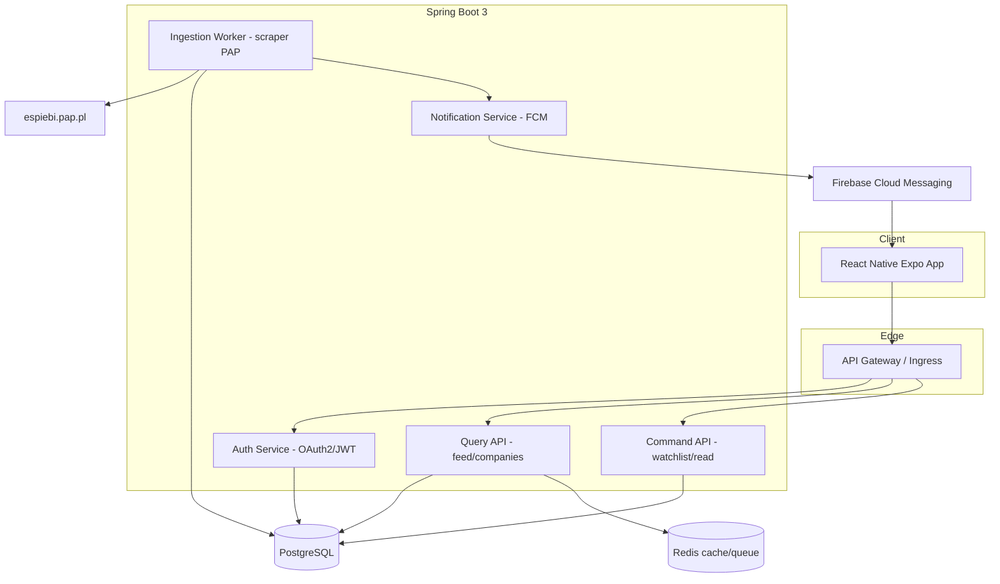

# Architektura systemu

## 1. Przegląd

Raportnik to system rozproszony oparty o Clean Architecture + DDD. Backend stosuje CQRS (oddzielenie zapisu od odczytu) i Repository Pattern. Pozyskiwanie danych z PAP odbywa się przez wymienialny `ReportIngestionSource` (scraper → API).

## 2. Diagram komponentów



## 3. Warstwy (Clean Architecture)

```
domain        -> encje, agregaty, reguły (zero zależności)
application   -> use-case'y, CQRS handlers, porty (interfejsy)
infrastructure-> repozytoria JPA, scraper, FCM, security
api           -> kontrolery REST, DTO, mappery
```

Zależności kierowane do środka: `api -> application -> domain`, `infrastructure` implementuje porty z `application`.

## 4. Przepływ ingestion + push


## 5. Niezawodność
- Retry z backoff + dead-letter dla ingestion.
- Idempotencja po `external_id`.
- Monitoring: Actuator + Prometheus + Grafana; logi JSON do Loki.
