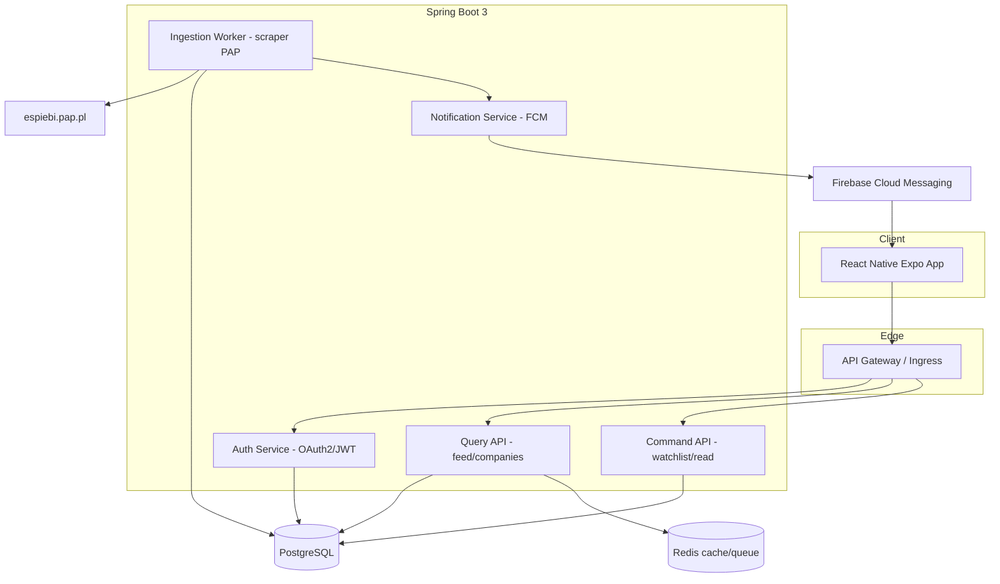
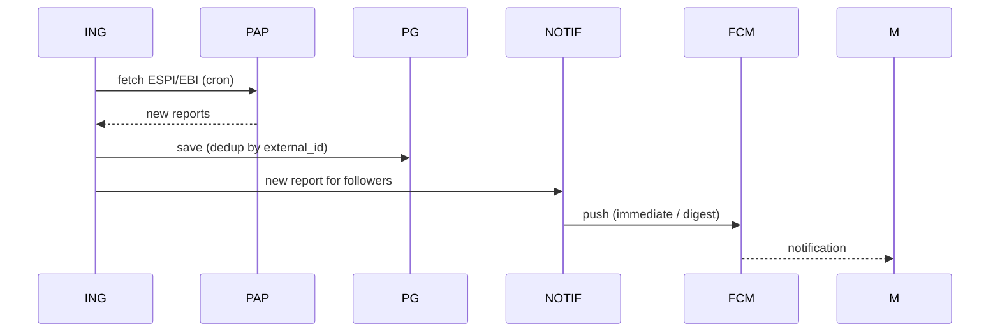

# System architecture

## 1. Overview

Raportnik is a distributed system based on Clean Architecture + DDD. The backend uses CQRS (separating writes from reads) and the Repository Pattern. Data ingestion from PAP is done through a swappable `ReportIngestionSource` (scraper → API).

## 2. Component diagram



## 3. Layers (Clean Architecture)

```
domain        -> entities, aggregates, rules (zero dependencies)
application   -> use cases, CQRS handlers, ports (interfaces)
infrastructure-> JPA repositories, scraper, FCM, security
api           -> REST controllers, DTOs, mappers
```

Dependencies point inward: `api -> application -> domain`, `infrastructure` implements ports from `application`.

## 4. Ingestion + push flow



## 5. Reliability
- Retry with backoff + dead-letter for ingestion.
- Idempotency by `external_id`.
- Monitoring: Actuator + Prometheus + Grafana; JSON logs to Loki.
